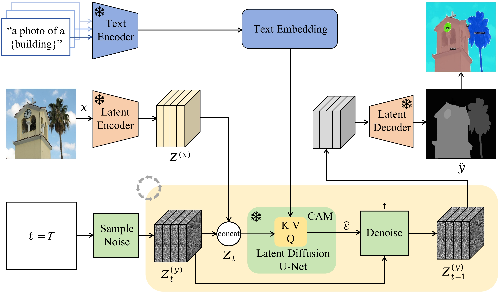
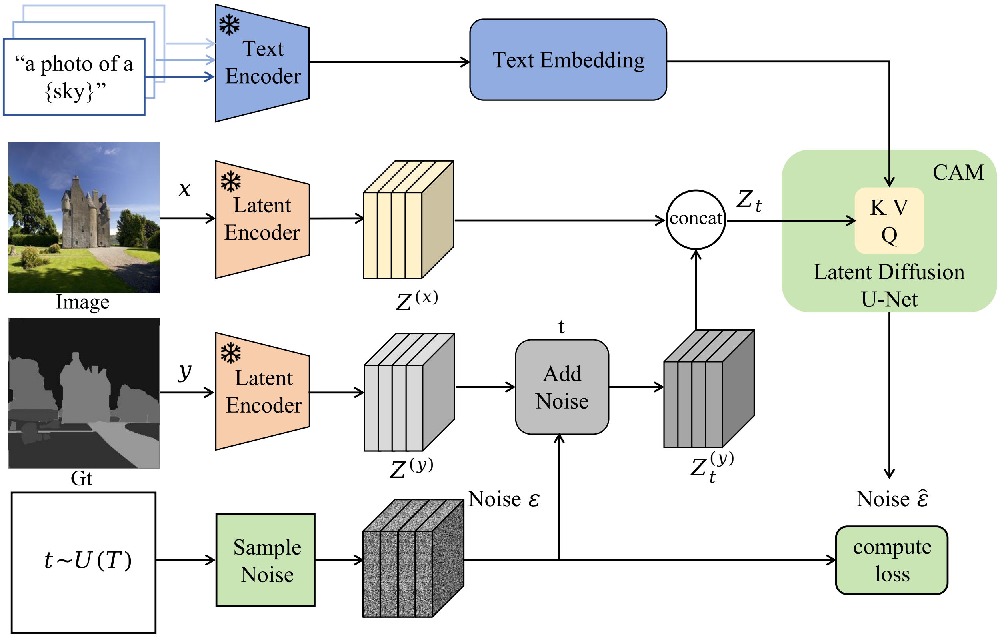
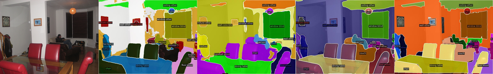
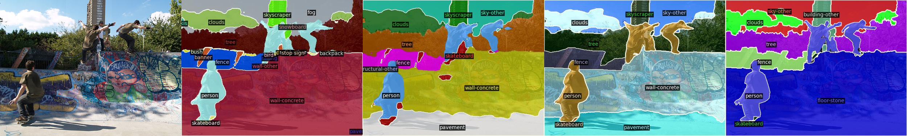
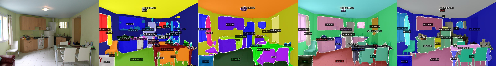
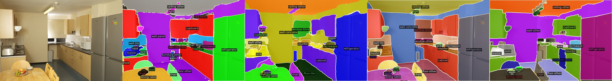

# Seg-diffusion
## Text-to-Image Diffusion Model for Open-Vocabulary Semantic Segmentation


## ⭐ [Comprehensive supplements](https://github.com/QuantumScriptHub/Seg-diffusion/blob/semantic_segmentation/result/icasspsupp.pdf)
For more details on the experimental setup and comprehensive visual contrast results, please refer to our extensive [supplementary materials](https://github.com/QuantumScriptHub/Seg-diffusion/blob/semantic_segmentation/result/icasspsupp.pdf).  

##  📢 Overview
<p align="justify">
  Open-vocabulary semantic segmentation (OVSS) is a challenging computer vision task that labels each pixel within an image based on text descriptions. Recent advancements in OVSS are largely attributed to the increased model capacity. However, these models often struggle with unfamiliar images or unseen text, as their visual language understanding is limited to training data. Text-to-image (T2I) diffusion  models have demonstrated strong image generation with diverse open-vocabulary descriptions. It prompted us to explore whether the comprehensive priors in T2I diffusion models could enhance the zero-shot generalization of OVSS.
In this study, we define OVSS as a denoising diffusion task from noisy to object mask and introduce Seg-diffusion, a novel method based on Stable Diffusion that utilizes its extensive visual and linguistic prior knowledge. Specifically, the object mask diffuses from ground-truth to a random distribution in latent space, and the model learns to reverse this noisy process to reconstruct object mask using text embeddings with our proposed Content Attention Module (CAM). 
Extensive experiments on popular OVSS benchmarks show that Seg-diffusion outperforms previous well-established methods and achieves impressive zero-shot  generalization to unseen datasets.
</p>

<div style="display:flex; justify-content:space-between;">
    
    
</div>

The left image shows the training process, while the right one illustrates the inference process.
##  🚀 Modest surprise

<p align="center" style="margin: 0; padding: 0;">
    
</p>

<p align="justify">
We present Seg-diffusion, a diffusion model and associated fine-tuning protocol for Open-Vocabulary semantic segmentation. Its core principle is to leverage the rich visual knowledge stored in modern generative image models. The order of the images from left to right in each row above is: Original, OVSeg, SAN, Ours, GT.
</p> 

More results can be viewed by clicking on [result](./result).

## ⬇ Datasets
**All datasets are available in public**.
* Download the ADE20K from [Here](https://groups.csail.mit.edu/vision/datasets/ADE20K/)
* Download the PASCAL VOC from [Here](https://datasetninja.com/pascal-voc-2012#download)
* Download the PASCAL-Context from [Here](https://cs.stanford.edu/~roozbeh/pascal-context/#download)
* Download the COCO-Stuff from [Here](https://github.com/nightrome/cocostuff)
  
## 🛠️  Dependencies
```bash
* Python >= 3.8.x
* Pytorch >= 2.0.1
* diffusers >= 0.25.1
* pip install -r requirements.txt
```
## 📦 Checkpoint cache

By default, our [checkpoint](https://drive.google.com/file/d/1o8gBxJAgppyGZYZ_NeuHRv3gL6mhf_B3/view?usp=drive_link) is stored in Google Drive.
You can click the link to download them and proceed directly with inference.

## ⚙ Configurations

#### Training

- --pretrained_model_name_or_path : [Pretrained model](https://huggingface.co/stabilityai/stable-diffusion-2/tree/main) path for stable-diffusion-2 from hugging face, you need to download it and place it in a local directory.  
- --train_img_list : img_list.txt, including the absolute path of all train images.  
- --train_gt_list : gt_list.txt, including the absolute path of all ground truth masks. These ground truth masks are represented using depth maps, where different depths correspond to different object categories.
- --train_text_list : train_text.json, JSON file containing the text descriptions corresponding to the training objects.
- --val_img : Path of the validation set of images.  
- --val_gt : Path of the validation set of ground truth masks.
- --val_text_list: Path of the validation set of text descriptions. 

#### Inference 

- --input_rgb_path : The local path of the image to be inferred.
- --output_dir : The output path of the image after inference.
- --class_name : a list with class name for open-vocabulary semantic segmentation
- --stable_diffusion_repo_path : [Pretrained model](https://huggingface.co/stabilityai/stable-diffusion-2/tree/main) path for stable-diffusion-2 from hugging face, you need to download it and place it in a local directory.
- --pretrained_model_path : The path of the best checkpoint saved by the model you trained，you can also use the [checkpoint](https://drive.google.com/file/d/1o8gBxJAgppyGZYZ_NeuHRv3gL6mhf_B3/view?usp=drive_link) we trained, load them into a local path, and proceed with inference directly.


The default settings are optimized for the best result. However, the behavior of the code can be customized:
- Trade-offs between the **accuracy** and **speed** (for both options, larger values result in better accuracy at the cost of slower inference.)
  - `--ensemble_size`: Number of inference passes in the ensemble. Default: 10.
  - `--denoise_steps`: Number of denoising steps of each inference pass. Default: 10.
- `--half_precision`: Run with half-precision (16-bit float) to reduce VRAM usage, might lead to suboptimal result.
- By default, the inference script resizes input images to the *processing resolution*, and then resizes the prediction back to the original resolution. This gives the best quality, as Stable Diffusion, from which Seg-diffusion is derived, performs best at 768x768 resolution.  
  - `--processing_res`: the processing resolution; set 0 to process the input resolution directly. Default: 768.
  - `--output_processing_res`: produce output at the processing resolution instead of upsampling it to the input resolution. Default: False.
- `--seed`: Random seed can be set to ensure additional reproducibility. Default: None (using current time as random seed).
- `--batch_size`: Batch size of repeated inference. Default: 0 (best value determined automatically).

## 💻 Testing on your images
### 📷 Prepare images
If you have images at hand, skip this step. Otherwise, download a few images from [Here](https://cs.stanford.edu/~roozbeh/pascal-context/#download)
### 🎮 Training and  Inference
Run **train.sh** and **inference.sh** scripts for  training and  inference.
```bash
git clone https://github.com/QuantumScriptHub/Seg-diffusion.git
cd scripts
bash train.sh

cd scripts
bash inference.sh
```

## 🎫 License

This work is licensed under the Apache License, Version 2.0 (as defined in the [LICENSE](LICENSE.txt)).

By downloading and using the code and model you agree to the terms in the  [LICENSE](LICENSE.txt).

[](https://www.apache.org/licenses/LICENSE-2.0)

